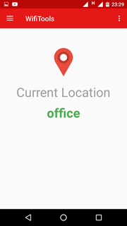
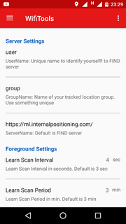
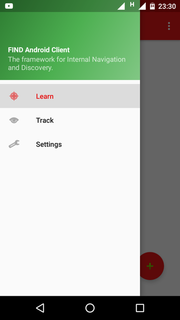

# FIND- Indoor Positioning System (Android Client App)

This client app helps you get started with FIND development. With this app you can easily:

 - "Learn": connect to the server and then submit fingerprints.
 - "Track": track what room you are in using just the WiFi networks around you
 - more coming soon...
All this using less battery and with higher accuracy indoors than the GPS.

----------

**About FIND**

The **Framework for Internal Navigation and Discovery (FIND)** allows you to use your (Android) smartphone or WiFi-enabled computer (laptop or Raspberry Pi or etc.) to determine your position within your home or office. You can easily use this system in place of motion sensors as its resolution will allow your phone to distinguish whether you are in the living room, the kitchen or the bedroom, etc. The position information can then be used in a variety of ways including home automation, way-finding, or tracking!
To learn more about it or to run your own private server, check out https://github.com/schollz/find

----------
**Requirements**
 1. Android Studio 
 2. Android Mobile with WiFi adapter

**Dependencies**
 1. OkHttp (Async HTTP library)

If you use Android Studio these dependencies are managed automatically for you. (When you first import the project you'll be asked to sync the relevant modules from the SDK manager.)

**Getting Started**
These instructions will get you a copy of the project up and running on your local machine for development and testing purposes. 

As usual, you get started by cloning the project to your local machine:
```
$ git clone git://github.com/uncleashi/find-app-android
```
**Building and Running**
Import the FindWifiTool app into Android Studio as an existing project and select :
```Run > Run app ```

**Default Configuration**
 1. User: user
 2. Group: group
 3. Server: https://ml.internalpositioning.com
 4. Learn Period: : 3 min
 5. Track Interval: 5 sec
 6. Learn Interval: 5 sec

**Wifi-Fingerprint:**
```json
{
"group":"some group",
	   "username":"some user",
	   "location":"some place",
	   "time":12309123,
	   "wifi-fingerprint":
	   [
	      {
	         "mac":"AA:AA:AA:AA:AA:AA",
	         "rssi":-45
	      },
	      {
	         "mac":"BB:BB:BB:BB:BB:BB",
	         "rssi":-55
	      }
   ]
}
```
Above JSON is sent via POST https://ml.internalpositioning.com/learn or POST https://ml.internalpositioning.com/track (or the server set by you ) depending on whether it is *Learning* or *Tracking*.

----------
**App Screenshots**






----------

**Authors**

 - Akshay Dekate
 - Shailesh Srivastava

----------

**License**

The code supplied here is covered under the MIT Open Source License:

Copyright (c) 2016 Akshay Dekate

Permission is hereby granted, free of charge, to any person obtaining a copy of this software and associated documentation files (the "Software"), to deal in the Software without restriction, including without limitation the rights to use, copy, modify, merge, publish, distribute, sublicense, and/or sell copies of the Software, and to permit persons to whom the Software is furnished to do so, subject to the following conditions:

The above copyright notice and this permission notice shall be included in all copies or substantial portions of the Software.

THE SOFTWARE IS PROVIDED "AS IS", WITHOUT WARRANTY OF ANY KIND, EXPRESS OR IMPLIED, INCLUDING BUT NOT LIMITED TO THE WARRANTIES OF MERCHANTABILITY, FITNESS FOR A PARTICULAR PURPOSE AND NONINFRINGEMENT. IN NO EVENT SHALL THE AUTHORS OR COPYRIGHT HOLDERS BE LIABLE FOR ANY CLAIM, DAMAGES OR OTHER LIABILITY, WHETHER IN AN ACTION OF CONTRACT, TORT OR OTHERWISE, ARISING FROM, OUT OF OR IN CONNECTION WITH THE SOFTWARE OR THE USE OR OTHER DEALINGS IN THE SOFTWARE.

----------
